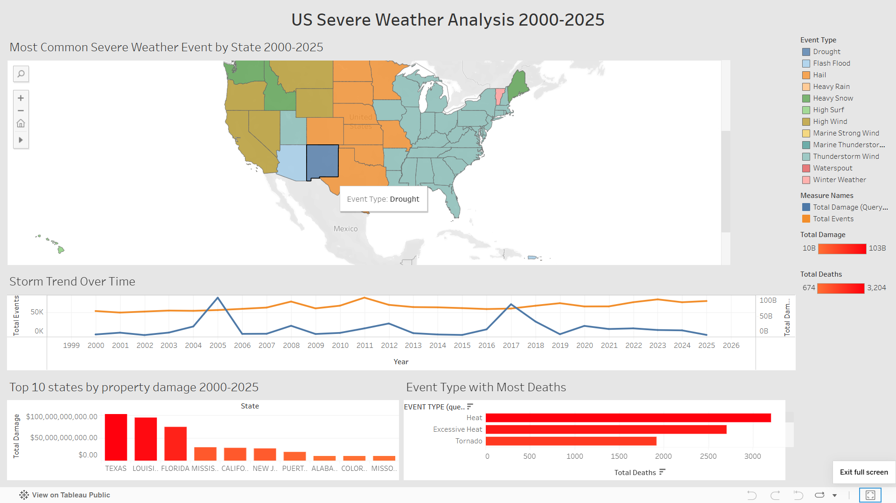

# Severe Weather Analysis (2000-2025)
## By Gregory

## Project Overview
This project will analyze 25 years of severe weather through the use of NOAA's Storm Events Database. My goal is to discover trends in storms, the damage, and the frequency. This will cover all states in the United States from the years 2000 to 2025.

## Questions I will explore
-Which state have undergone the most property damage from severe weather events?

-Is severe weather getting worse over the past 25 years? Is the frequency or cost going up with time?

-What weather event is the most common in each state?

-Which event causes the most deaths and injuries?

-What were the most destructive weather events?

## Data Source
**Source**: NOAA National Center for Environmental Information

**Dataset**: Storm Events Database - Details Files

**Time Period**: January 2000 - December 2025

**Link**: https://www.ncei.noaa.gov/pub/data/swdi/stormevents/csvfiles/

## Tools Used

**DataGrip** - SQL queries and data cleaning

**SQLite** - Database engine

**Tableau Public** - Data visualization and dashboards

**GitHub** - Version control and portfolio hosting

## Data Cleaning
The NOAA data stores damage both property and crop as text strings (250K, 1M, ETC), I used a CASE statement to convert these numbers into real numbers and input them into new columns labeled damage_property_usd, and damage_crops_usd.

## Dashboard

[US Severe Weather Dashboard

View the live interactive version here:
[US Severe Weather Analysis 2000-2025](your tableau public link)her Analysis 2000-2025]:

https://public.tableau.com/app/profile/greg.howell6601/viz/SevereWeatherAnalysis2000-2025/USSevereWeatherAnalysis2000-2025?publish=yes

